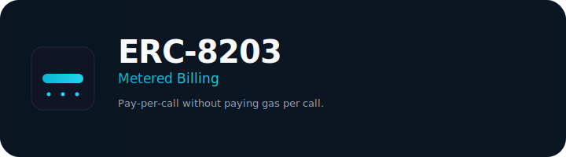
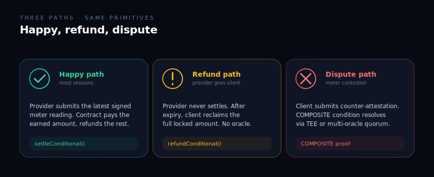

<picture>
  <source media="(prefers-color-scheme: dark)" srcset=".github/assets/logo-dark.svg">
  <source media="(prefers-color-scheme: light)" srcset=".github/assets/logo-light.svg">
  
</picture>

 

  
  
  
  

 

---

## TL;DR

Pay-per-call billing between autonomous agents, without paying gas per call.

Open a session by locking a max budget on-chain. Stream signed usage receipts off-chain. Settle on-chain in one transaction at the end. Disputes resolve through the same primitives ERC-8203 already defines.

This repo is a **non-normative profile**. It documents how the existing ERC-8203 interface supports metered billing as a pattern. No new contracts, no new interface, no new ERC.

---

## How it works

  

Three stages:

| Stage | Where | What happens |
|---|---|---|
| **Open** | off-chain | Client signs a `ConditionalLock` capping the session budget. No tx. |
| **Meter** | off-chain | Provider streams signed meter receipts (cumulative units, monotonic sequence). |
| **Settle** | one on-chain tx | Either party submits the latest receipt. Contract pays the earned amount, refunds the rest. |

The cost stays flat regardless of call count. 10 API calls or 10,000 calls, same on-chain footprint.

---

## Three settlement paths

The same primitives handle the happy case, the silent-provider case, and the contested-meter case.

  

---

## When to use this

| Use case | Fit |
|---|---|
| Agent-to-API billing per call | Strong |
| Compute metering (GPU hours, token generations) | Strong |
| Data feed subscriptions with rollover | Strong |
| Micro-payments under a cent (batched) | Strong, gas amortizes |
| One-shot purchases | Overkill, use direct settlement |

---

## Key properties

- **Budget is the ceiling.** `lock.amount` is the hard cap. The oracle cannot attest more than what was locked.
- **Sequence numbers prevent replay.** Old meter readings cannot replace newer ones.
- **Provider griefing is bounded.** If they vanish, the client refunds the whole lock after expiry.
- **Batching scales.** One `settleConditional` with a merkle root settles N sessions at once. ~20× cheaper than per-session txs.
- **Composes with ERC-8183.** Job escrow sets the ceiling, metered billing determines the actual payout.

  

---

## Read the full profile

The complete worked example (lifecycle, dispute paths, batching, security, open questions) lives at:

> [`docs/profile.md`](docs/profile.md)

Around 200 lines. Concrete pseudo-Solidity throughout.

---

## Where it sits in the agent stack

  

ERC-8203 already defines the building blocks this profile uses:

- `ConditionalLock` with `verifier` field (post-#15 of the Magicians thread)
- `SettlementProofRef` with `proofType: ORACLE_ATTESTATION` or `RECEIPT_ROOT`
- `settleConditional` and `refundConditional` for happy and timeout paths
- `COMPOSITE` condition for combining oracle attestation with timelock

The profile shows how to plug a metering oracle into `verifier`, what the receipt format looks like, and how to batch via merkle roots. Nothing in here requires a new interface.

If multiple independent implementations end up converging on similar recurring-lock semantics, a companion ERC may be worth writing. Today, the primitives are sufficient.

---

## Open questions

These are flagged in the profile and open for discussion on Magicians:

1. Should `unitPrice` be fixed at session open or floating?
2. Should the oracle attest to units only (contract computes amount) or to the final amount directly?
3. Is a standard `IMeteringOracle` interface worth defining, or is the attestation format sufficient?

---

## Related work

- [ERC-8203 main thread](https://ethereum-magicians.org/t/erc-8203-agent-off-chain-conditional-settlement-extension-interface/28041) on Ethereum Magicians
- [ERC-8203 PR #1614](https://github.com/ethereum/ERCs/pull/1614) on `ethereum/ERCs`
- [Reference implementation](https://github.com/Aboudjem/erc-8203-ref) (Solidity + Foundry, 24 tests)
- [ERC-8183: Agentic Commerce](https://ethereum-magicians.org/t/erc-8183-agentic-commerce/27902) for job-level escrow that this profile composes with

---

## Contributing

See [`CONTRIBUTING.md`](CONTRIBUTING.md). Short version: open an issue or PR. Discussion of the profile itself belongs on the Magicians thread.

---

Built by <a href="https://github.com/Aboudjem">Adam Boudj</a> · CC0-1.0 · No telemetry

  

